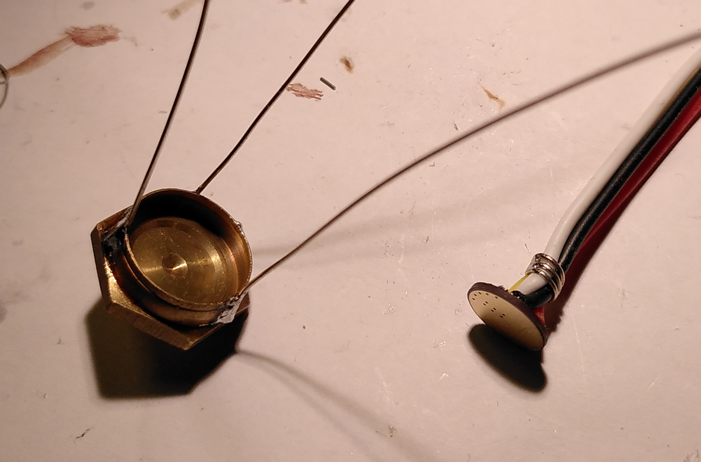
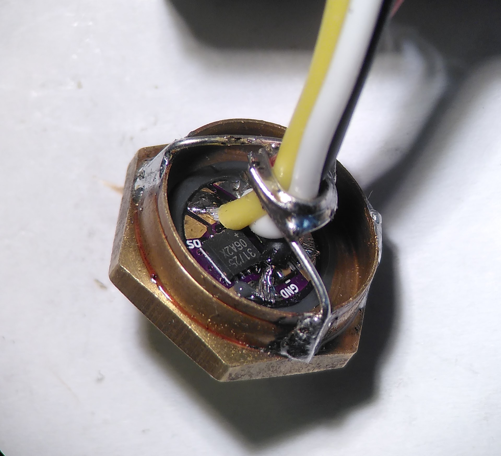
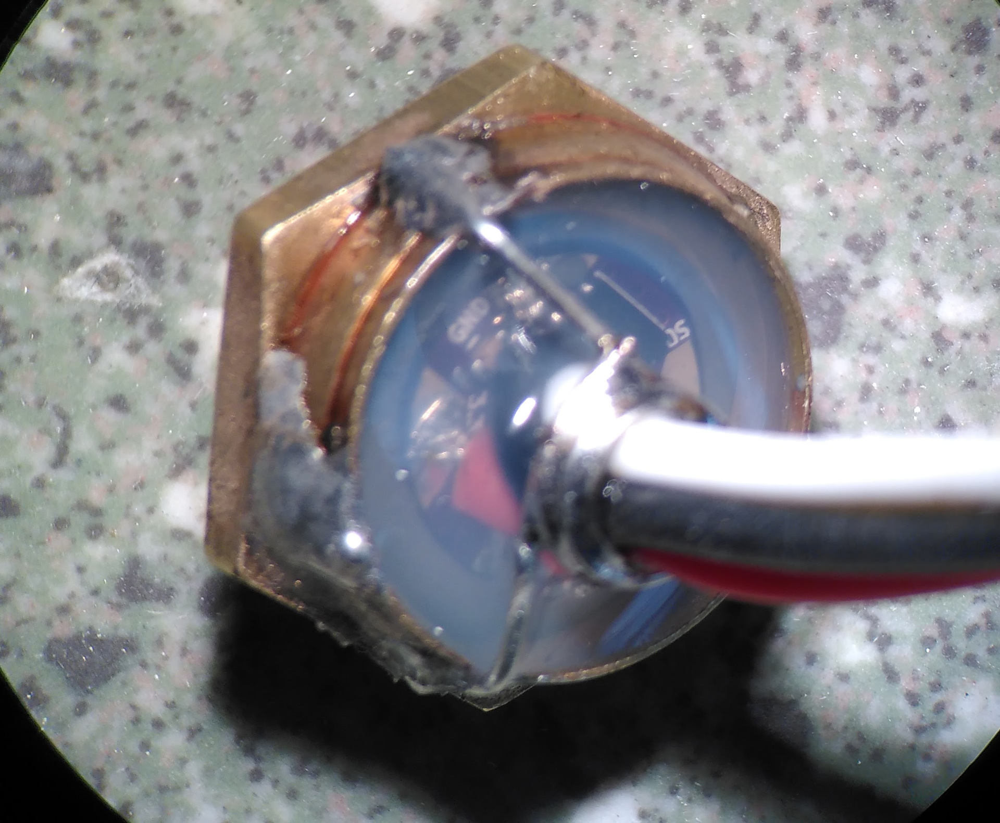
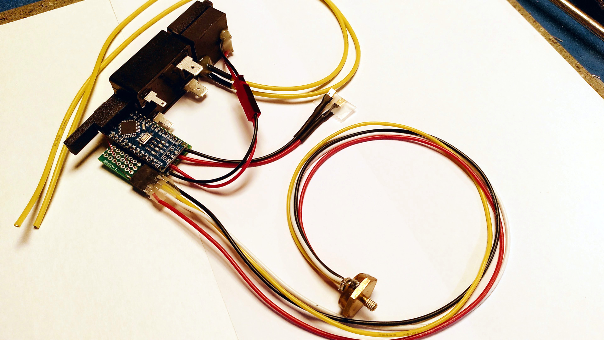
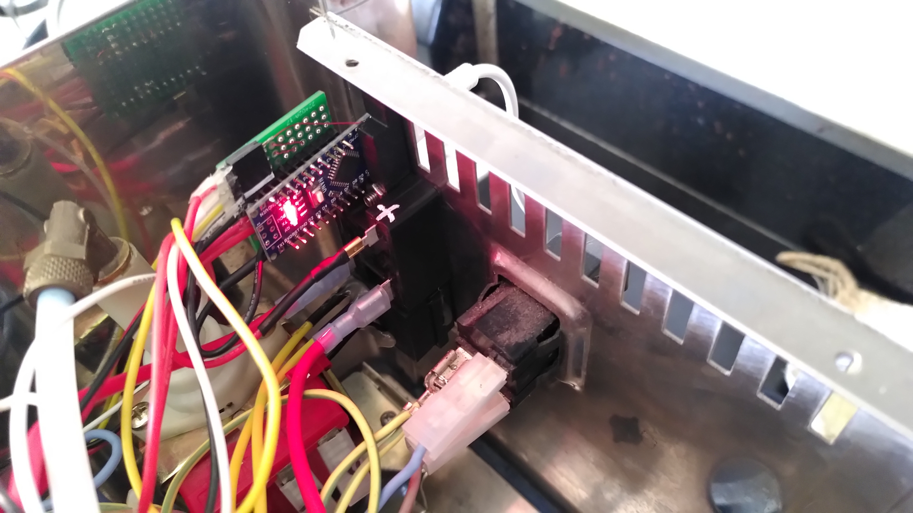
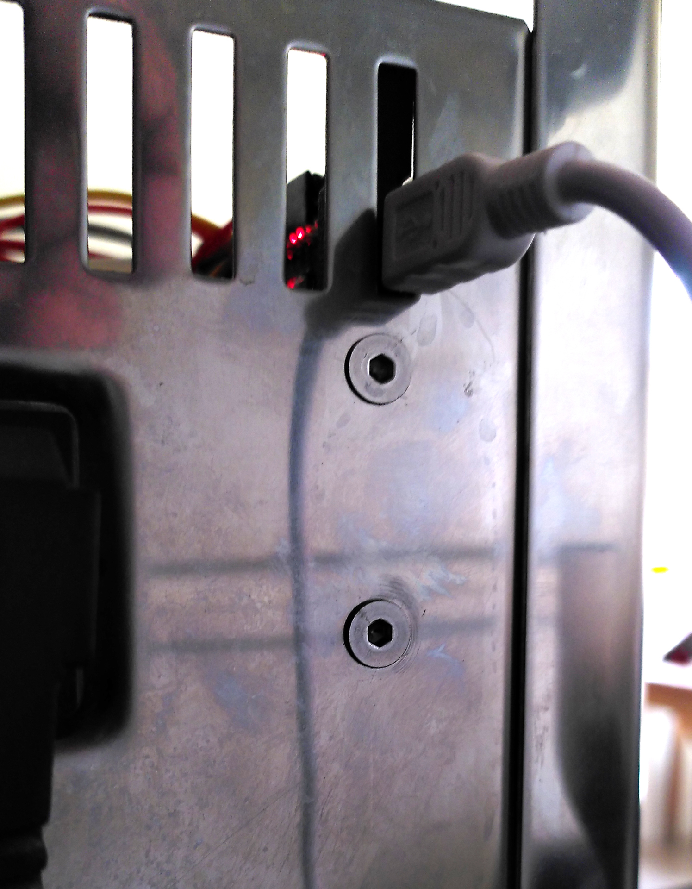
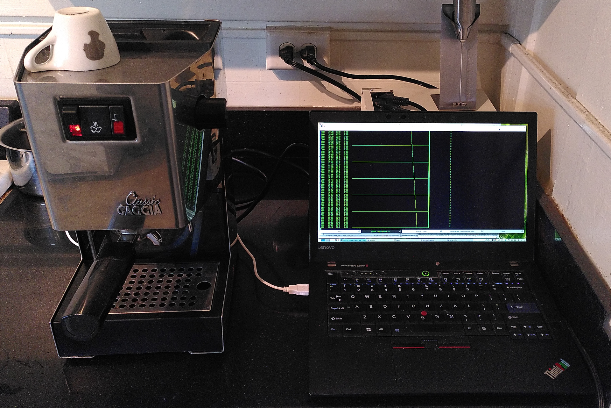

PID controller for Gaggia Classic
=================================

# Temperature Sensor
Using the [Max31725] for nice high accuracy and fast temperature updates. Also
a bit overengineered, but that is what I had lying around.

The sensor is on a little PCB (which you find in the
[sensor-mount/](./sensor-mount) directory. Glued into the existing brass
screw-cups the original bimetallic sensor was in (using JB Weld, which is
a sufficiently high-temperature epoxy), then wired up with silicone wiring and
sealed with silicone.

Mount on the side of the boiler where the original brew temp sensor was.

PCB            | Preparing mount | Glued in cup | Sealed
---------------|-----------------|--------------|--------
 |  |  | 

# PID Controller

Runs on a conventional Arduino Nano.

To program, get avr-gcc and avrdude. The Makefile takes care of compiling
and flashing:

```
cd firmware
make flash
```

The sytem is powered with a sealed 5V power supply CUI PSK-3D-5.
The Solid State Relay is a Panasonic AQJ112V.

The USB connector is arranged in a way that it is reachable through one of the
opening on the back. From the front, the machine is entirely unaltered (unlike
many of the somewhat ugly PID mods of this machine).

You connect with a serial console to the PID controller, adjust
PID parameters and watch an ASCII-art 'graphical' output of the temperature
sensor (see the picture with the Laptop in view and the rising temperature
displayed).

PID parameters can be tuned with the interface presented on the serial
interface and stored in EEPROM.

Serial interface running by default on 38400 bps:

```bash
tio -b 38400 /dev/ttyUSB0
```

Menu:
```
#            ☕ Gaggia PID controller
#(c) 2021 Henner Zeller  |  GNU Public License
#Commands
#       l - Start log to console. Stop with any key.
#       L - Ditto. With 'graph'
#       n - Now. Print PID parameters, last temp and control out.
#
#       s <setpoint> - set setpoint.
#       p <Kp>       - set proportional gain.
#       i <Ki>       - set integral gain.
#       d <Kd>       - set derivative gain.
#
#       w - Write PID parameters to EEPROM.
#       r - Restore PID parameters from EEPROM.
#       h - This help
```

Components         | Mounted | Back  | Settings via USB
-------------------|---------|-------|--------------------------
 |  |  | 

[Max31725]: https://datasheets.maximintegrated.com/en/ds/MAX31725-MAX31726.pdf
